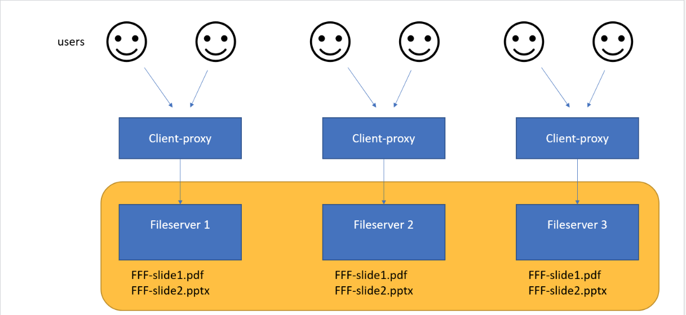
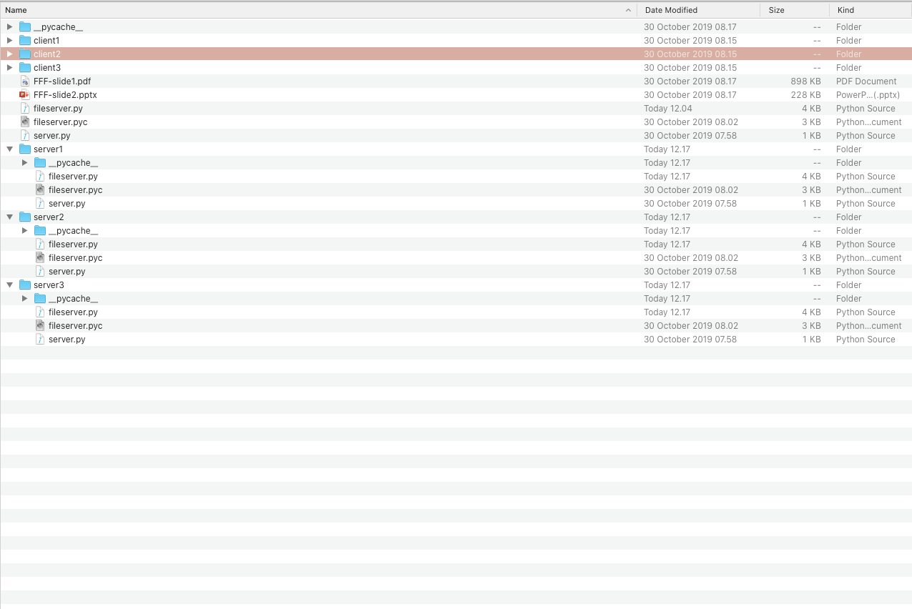
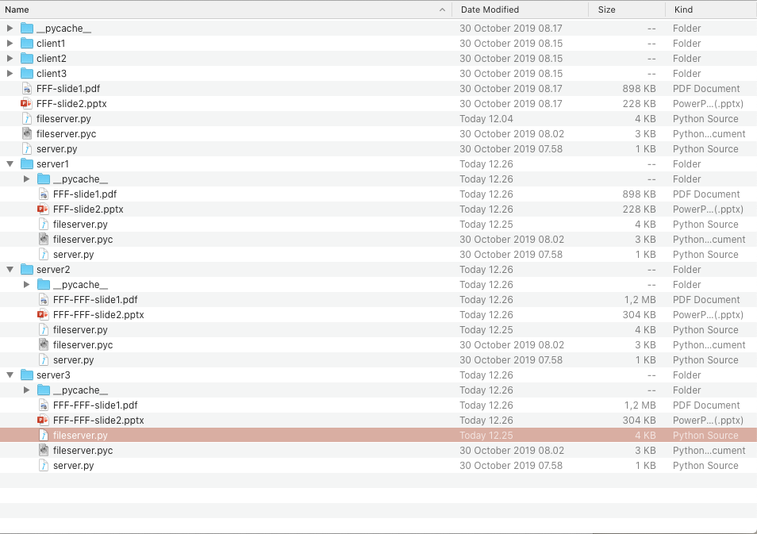
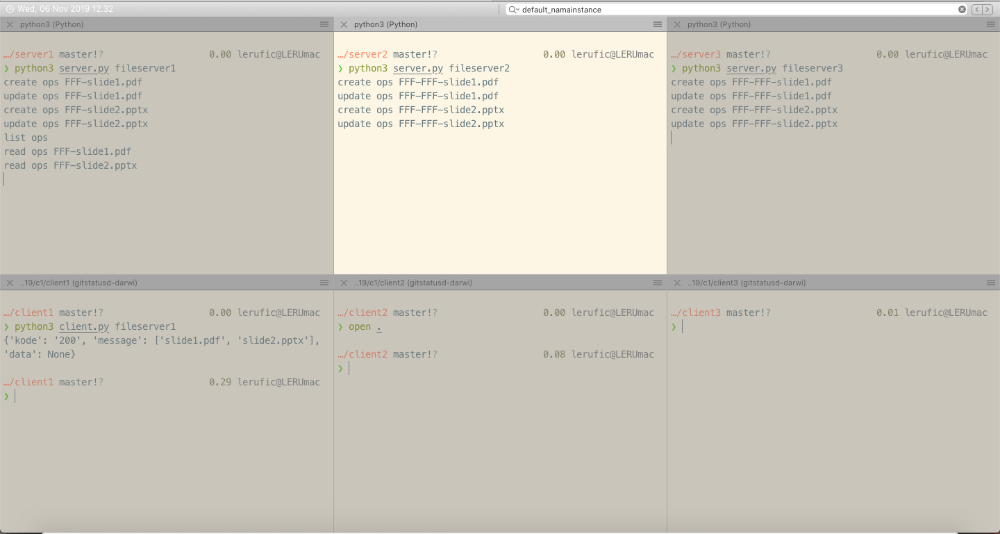

# Tugas 5

## Permasalahan
Membuat sebuah data-centric agar ketika client ingin mengakses data dari salah satu tiga fileserver, bisa mengakses file yang benar.

## Desain Infrastruktur


## Penyelesaian
Solusi yang saya tawarkan adalah dengan menggunakan sistem replikasi. Jadi semisal client1 mengirim data dan diterima oleh server1. Maka server1 akan bertugas sebagai Replication Manager untuk mereplikasi file ke server lainnya.

Berikut potongan code untuk replikasi pada server
```python
def replicateCreate(self,namainstance,name='filename000'):
        nama='FFF-{}' . format(name)
        for i in self.all_nameserver:
            if namainstance == i:
                self.create(i,name)
            else:
                uri = "PYRONAME:{}@localhost:7777" . format(i)
                with Pyro4.Proxy(uri) as p:
                    try:
                        p._pyroBind()
                        p.create(i,nama)
                    except Pyro4.errors.CommunicationError:
                        print("Server is not Reachable. Try Again Later!")
            
    def replicateUpdate(self,namainstance,name='filename000',content=''):
        nama='FFF-{}' . format(name)
        for i in self.all_nameserver:
            if namainstance == i:
                self.update(i,name,content)
            else:
                uri = "PYRONAME:{}@localhost:7777" . format(i)
                with Pyro4.Proxy(uri) as p:
                    try:
                        p._pyroBind()
                        p.update(i,nama,content = open(nama,'rb+').read())
                    except Pyro4.errors.CommunicationError:
                        print("Server is not Reachable. Try Again Later!")
```
## Cara Kerja
Client1 melakukan request update data suatu file ke fileserver1. fileserver1 melakukan proses update file pada storage miliknya. Setelah selesai melakukan update. maka fileserver1 berikutnya akan menjadi replication manager. Tugasnya adalah melakukan proses mengirim file yang barusan saja di-update untuk dikirim ke seluruh server.

Agar hal ini bisa berjalan dengan semestinya. Fileserver harus menyimpan instance dari masing-masing server. Sehingga ketika ada fileserver baru yang bergabung. Perlu diadakan update list fileserver ke semua fileserver.

## Hasil Percobaan
Berikut adalah kondisi awal pada masing-masing server.


Dan berikut adalah kondisi akhir pada masing-masing server setelah client1 menjalankan perintah


Berikut adalah kondisi terminal dan cara menjalankan program pythonnya.
